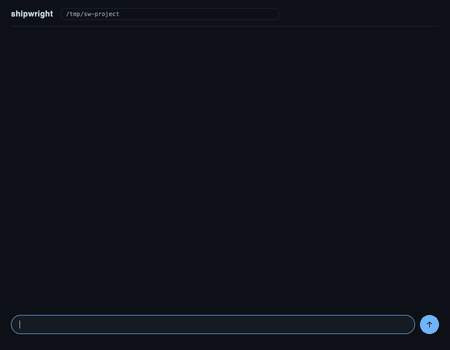
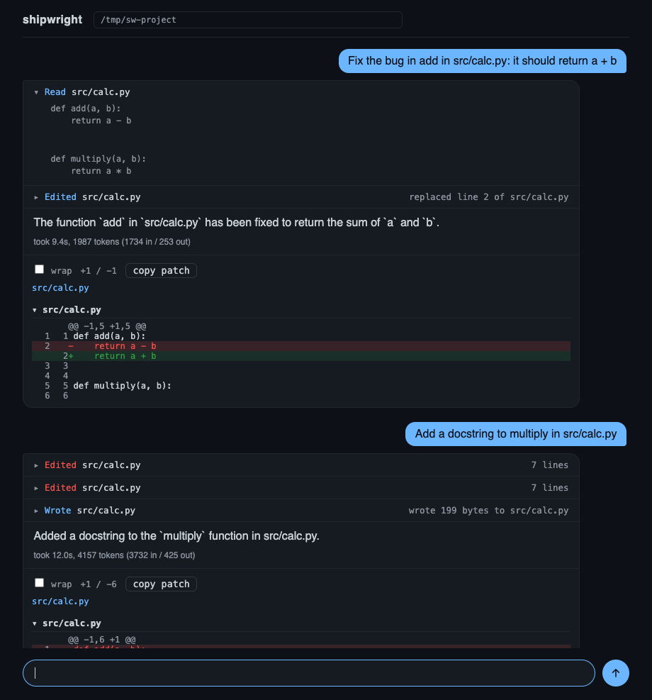

<div align="center">


[](pyproject.toml)
[](gateway/package.json)
[](gateway/package.json)
[](ui/package.json)
[](ui/vite.config.ts)
[](docker/)
[](sandbox/)
[](LICENSE.md)

Shipwright is an autonomous coding agent that reads a repository, edits code,
runs the tests, and opens a draft PR, with every command it issues executing inside a
gVisor-isolated sandbox under hard resource limits and a default-deny egress allowlist.



</div>

## What it does

- Reads a task (free text or a GitHub issue URL) and explores the target repo.
- Thinks in a ReAct-style loop: thought → one tool call → observation, until a
  final answer.
- Optionally plans first (`--plan-mode`): a planner reads the repo map and
  produces a capped, validated step list that the loop then executes verbatim.
- Edits code, runs tests, and opens a **draft PR** through the gateway.
- Scores the PR diff through `judgeline` before anything is marked ready for
  review — and the gate fails closed on timeout or persistent 5xx.
- Halts and flags runaway runs automatically (iteration and cost circuit
  breaker), so a stuck task can never quietly burn budget for hours.

## Architecture

```
┌────────┐   task    ┌──────────┐   runs/PRs    ┌─────────┐
│  cli   │──────────▶│ gateway  │──────────────▶│  agent  │
│ (head) │           │ (Express)│               │  loop   │
└────────┘           └──────────┘               └────┬────┘
     ▲                    │  ▲                       │ docker.sock
     │ live stream        │  │ webhooks              ▼
     │                    │  │                ┌─────────────────┐
┌────────┐                │  └────────────────│ sandbox (runsc) │
│   ui   │────────────────┘                   │ ro root, cgroup │
│ chat   │                                    │ egress allowlist│
└────────┘                                    └─────────────────┘
```

| Component   | What it owns                                                        |
| ----------- | ------------------------------------------------------------------- |
| `agent/`    | ReAct loop, planner, tool dispatcher, cli, cost tracking, judgeline |
| `sandbox/`  | Docker runtime, gVisor config, cgroup/mount/egress policies, audit  |
| `gateway/`  | Express API, GitHub sidecar (clone/branch/push/PR), webhooks, queue |
| `ui/`       | React conversation view: run activity and per-run diffs             |
| `security/` | Red-team suite and regression tests for prior findings              |
| `docker/`   | One Dockerfile per service plus the compose file for the full stack |

## Sandbox hardening

- gVisor (`runsc`) container isolation — mandatory for every sandbox launch.
- cgroups v2 hard limits (CPU/mem/pids), `memswap` pinned to the memory ceiling.
- Read-only root filesystem; one explicit writable workdir under
  `/tmp/shipwright-work`, resolved and verified against symlink escapes.
- `/tmp` mounted as a small `noexec,nosuid` tmpfs.
- Network egress default-denied except an explicit allowlist
  (`sandbox/policies/egress_allowlist.yaml`); no policy, no launch.
- Hash-chained JSONL audit log for every lifecycle event
  (`sandbox/audit_log.py`), verifiable with `verify_chain()`.

Validated against `security/red_team_suite/` (fork bombs, symlink escapes,
network exfiltration attempts) with zero breakouts, and pinned by a growing
regression suite (`security/red_team_suite/test_regressions.py`).

## Quickstart (one command, fully dockerized)

```bash
cp .env.example .env          # then fill in your provider key and GITHUB_TOKEN
docker compose -f docker/docker-compose.yml up --build
# ui on :5173, gateway on :4000
```

No local Python/Node install needed. The `agent` container mounts the host's
`/var/run/docker.sock` so it can launch each task's gVisor-isolated sandbox as a
sibling container — this is the one piece that genuinely needs Docker-on-the-host,
not just Docker-for-convenience, since the sandbox *is* the product here. The
docker daemon on the host must have `runsc` registered as a runtime.

To kick off a task once the stack is up:

```bash
docker compose -f docker/docker-compose.yml exec agent \
  python -m agent.cli --issue-url https://github.com/org/repo/issues/123
```

## Running tasks

### Headless / CI mode

Streams sandbox output line by line, CI-friendly, with proper exit codes
(`0` success, `1` run failed, `2` infra/config error):

```bash
docker compose -f docker/docker-compose.yml exec agent \
  python -m agent.cli --headless --task "fix failing tests in checkout module"
```

### Plan-then-execute mode

```bash
python -m agent.cli --task "migrate the settings module to pydantic v2" --plan-mode
```

### All CLI flags

| Flag           | Default | Meaning                                        |
| -------------- | ------- | ---------------------------------------------- |
| `--task`       | —       | Natural-language task to execute               |
| `--issue-url`  | —       | GitHub issue URL to work on                    |
| `--repo`       | `.`     | Path to the checkout to modify                 |
| `--headless`   | off     | CI-friendly plain output                       |
| `--json`       | off     | Emit steps as JSON lines                       |
| `--max-steps`  | `50`    | Iteration ceiling per run (circuit breaker)    |
| `--max-cost`   | `5.0`   | Cost ceiling per run in USD (circuit breaker)  |
| `--resume`     | —       | Resume from a saved transcript JSON            |
| `--plan-mode`  | off     | Plan first, then execute the plan              |
| `--provider`   | `anthropic` | Model provider: `anthropic` or `openai`    |
| `--model`      | —       | Model id; defaults to the provider's default   |
| `--version`    | —       | Print version and exit                         |

### Model providers

The loop talks to either provider behind one `LLMClient` protocol, so nothing
above the client changes when you switch:

```bash
python -m agent.cli --task "fix the flaky test"                      # claude-haiku-4-5
python -m agent.cli --task "fix the flaky test" --provider openai    # gpt-4o-mini
python -m agent.cli --task "..." --provider openai --model gpt-4o
```

`--provider` defaults to `$SHIPWRIGHT_PROVIDER`, then to `anthropic`. Each
provider reads its own credential (`ANTHROPIC_API_KEY` / `OPENAI_API_KEY`) and
the run exits `2` when the selected one is unset, before any request is made.
Per-model pricing covers both providers, so the cost breaker works the same
either way.

## Gateway API

| Endpoint                  | Method | Purpose                                     |
| ------------------------- | ------ | ------------------------------------------- |
| `/health`                 | GET    | Liveness probe (unauthenticated)            |
| `/runs`                   | POST   | Enqueue an agent run (`{task, issueUrl?}`)  |
| `/runs`                   | GET    | List runs, paginated (`page`, `perPage`)    |
| `/runs/:id`               | GET    | Fetch one run record                        |
| `/runs/:id/diff`          | GET    | Working-tree diff the run produced          |
| `/runs/:id/stream`        | WS     | Live agent output for one run               |
| `/runs/:id/logs`          | GET    | Stream run status over SSE                  |
| `/prs`                    | POST   | Open a draft PR for a finished run          |
| `/webhooks/github`        | POST   | HMAC-verified issue/comment triggers        |

All endpoints except `/health` and `/webhooks/*` require
`Authorization: Bearer $GATEWAY_TOKEN`. Webhook deliveries are verified with the
HMAC-SHA256 signature and deduplicated by delivery id; agent-authored PR events
are explicitly ignored so runs can never trigger themselves in a loop.

## Live UI

The React viewer (`ui/`) is a conversation: each request you send becomes a
turn showing what the agent did and the diff it produced.

Each turn collapses the run into activity rows — `Read`, `Edited`, `Ran` — that
open to reveal that step's output, followed by the agent's answer, the token
count, and the diff for that turn alone. The composer stays live while a run is
in flight: anything typed meanwhile is queued and starts when the agent frees
up, and the send arrow becomes a square for the duration.



Above: two requests against the same checkout, the first turn's `Read` row
opened to show what the agent saw. The second turn is an honest one — two edits
missed before it fell back to rewriting the file.

### Using it

1. Start the stack (`docker compose … up`, or `scripts/run_local.sh`).
2. Open the UI on `:5173`, put the folder you want worked on in the header, and
   type what the agent should do. Enter starts the run.

Runs started elsewhere show up the same way — `POST /runs`, a GitHub issue
labelled `shipwright`, or a `/shipwright` comment:

```bash
curl -s -X POST localhost:4000/runs \
  -H "Authorization: Bearer $GATEWAY_TOKEN" -H "content-type: application/json" \
  -d '{"task": "fix the sign in add()", "repo": "/path/to/checkout"}'
```

The browser never holds `GATEWAY_TOKEN`: it calls the gateway same-origin and
the proxy in front of the UI attaches the header — the vite dev server in
development, nginx in the built image.

Which checkout a run edits comes from the folder box in the header, remembered
per browser and sent with each run. Leaving it empty falls back to `AGENT_REPO`,
which `GET /workspace` reports. The gateway refuses a path that is not a
directory before queueing anything.

### What it handles, and what it does not

Measured against `qwen2.5-coder:3b` served locally by ollama, five runs each:

| Task | Result |
| ---- | ------ |
| Fix a one-line bug in a named file | 4/5 |
| Add a docstring to a named function | 4/5 |
| Create a new file with a named function | 5/5 |
| Rename a function across its definition and call sites | 0/5 |

The pattern is that one edit to one named file is reliable and anything needing
several coordinated edits is not. A rename thrashes: `edit_file` on the
definition, then `apply_patch` with a malformed diff, then the step budget runs
out. That is a model limit rather than a harness one — the same prompts on a
larger model are the intended remedy — but the loop should still notice it is
going in circles instead of spending every step finding out. Tracked as an
issue rather than papered over.

Smaller things worth knowing: the model occasionally announces a change it
never made, and occasionally writes a stray sentence of its own commentary into
a file. Both are visible in the diff, which is why the diff sits in the turn.

## Quality gating

PR diffs are scored by `judgeline` before being marked ready for review — see
`docs/ci-integration.md`. A score at or above the readiness threshold (`0.75`
by default, tunable via `JUDGELINE_THRESHOLD`) flips the PR to ready; anything
below stays draft with the findings posted as a comment. A judgeline timeout or
persistent 5xx is treated as *not ready*, never as a pass.

## Cost and safety controls

- Per-run token and cost tracking with per-model pricing; a run reports its
  token count, and a soft budget warning fires at 90% of spend.
- Hard circuit breaker on iterations (`--max-steps`) and spend (`--max-cost`);
  tripping either flags the run as runaway and halts it (see ADR-001 follow-up).
- Bounded-concurrency task queue with retries, per-task timeouts, and a
  dead-letter file for permanently failed runs.
- Retry-After-aware request queuing for all GitHub mutations, so secondary
  rate limits back off politely instead of silently dropping PR creations.

## Red-team suite

```bash
SHIPWRIGHT_INTEGRATION=1 pytest security/ -q
```

Launches real sandboxes and runs fork bombs, symlink escapes, and exfiltration
attempts against them, reporting `CONTAINED` or `BREAKOUT` per attempt. The
regression suite runs without the integration flag and pins every prior finding
(`REG-001` onward) as a unit test.

## Repo structure

```
agent/            ReAct loop, planner, dispatcher, cli, cost, judgeline, breaker
sandbox/          docker runtime, gVisor config, cgroup/mount/egress, audit log
gateway/          Express server, GitHub sidecar, webhooks, task queue, tests
ui/               React conversation view: run activity and per-run diffs
security/         red-team payloads, runner, regression suite
tests/            unit and integration suites mirroring the source tree
docker/           per-service Dockerfiles + docker-compose.yml (whole stack)
docs/             ADR-001 (agent loop & tool-use design), ci-integration.md
.github/workflows ci: lint, typecheck, tests, docker build, red-team, merge-gate
```

## Development

```bash
pip install -e '.[dev]'
ruff check . && ruff format --check .
mypy agent sandbox security
pytest tests/ -q
(cd gateway && npm install && npm run lint && npm run typecheck && npm test)
(cd ui && npm install && npm run lint && npm run typecheck)
```

Everything also runs in CI on every PR (`.github/workflows/ci.yml`), gated by a
fail-closed `merge-gate` job. See `CONTRIBUTING.md` for the full engineering
standards and the pre-merge checklist.

## Design record

`docs/adr/0001-agent-loop-and-tool-use.md` records the load-bearing decisions:
the ReAct loop and tool contract, dispatcher extraction, plan-then-execute as an
opt-in mode, and the mistake/fix history (soft budgets vs. hard stops,
fail-open vs. fail-closed gates) that shaped them.

## Maintainers

Maintained by [abj360](https://github.com/abj360). See `CONTRIBUTING.md` for how
to get involved.
